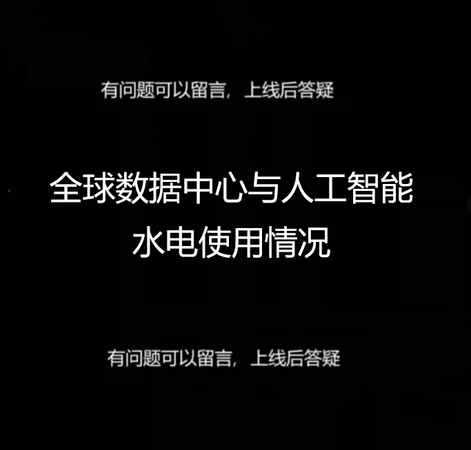
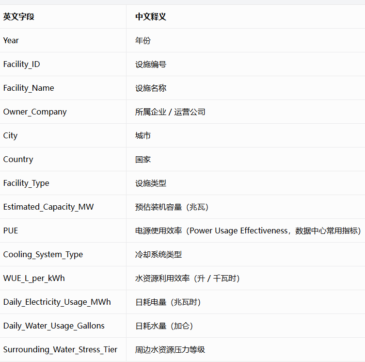
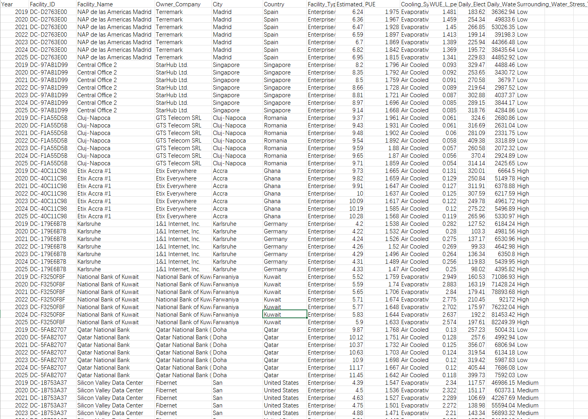
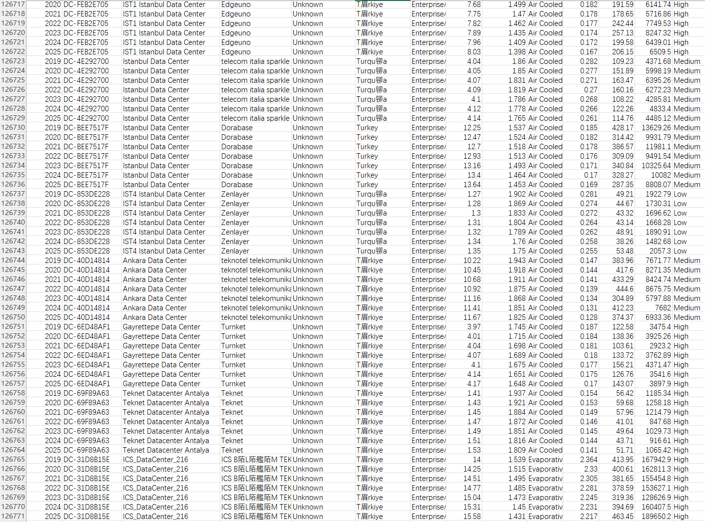

## Body

Global Data Centers and AI Hydropower Use (2019–2025)

The dataset provides a global estimate of energy and water usage time series view for 18,110 real data center locations from 2019 to 2025. It aims to conduct data analysis, machine learning, forecasting, sustainable development research, and environmental impact studies.

Dataset highlights:
- 18,110 data center facilities
- 126,770 records
- 7 years (2019–2025)
- Global coverage
- Time series structure

Statistical fields can be seen in the product image.

## Images

item_1059686816383

Here is a pay link on Stripe ( https://buy.stripe.com/3cs8yP7sY87d0vu9AB ). Please contact me lonlonago@foxmail.com after funding $89, and I will send you a complete data files , thank you!

